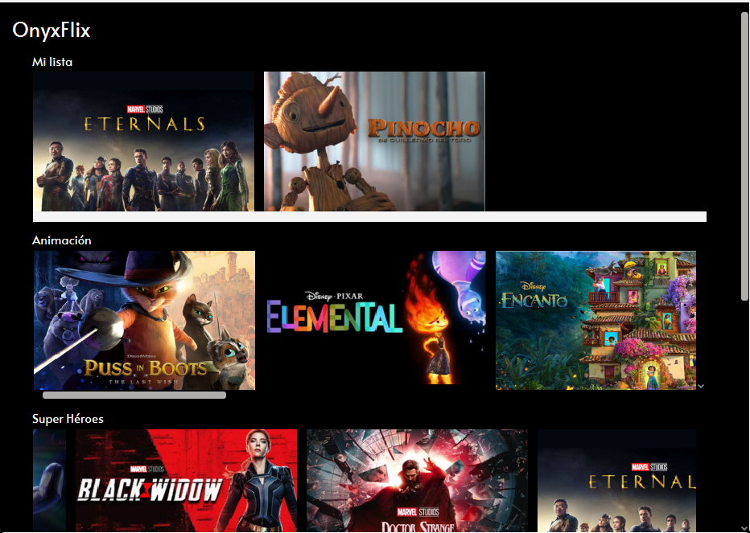
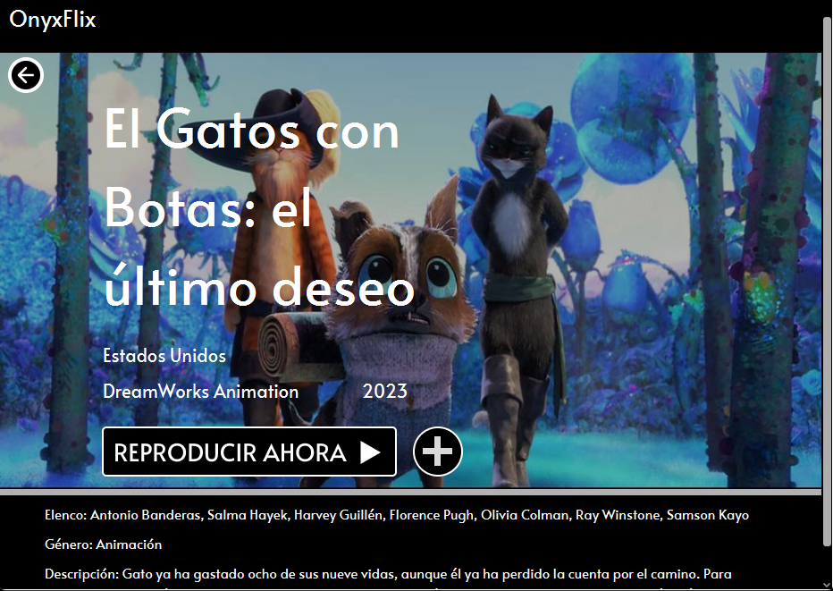
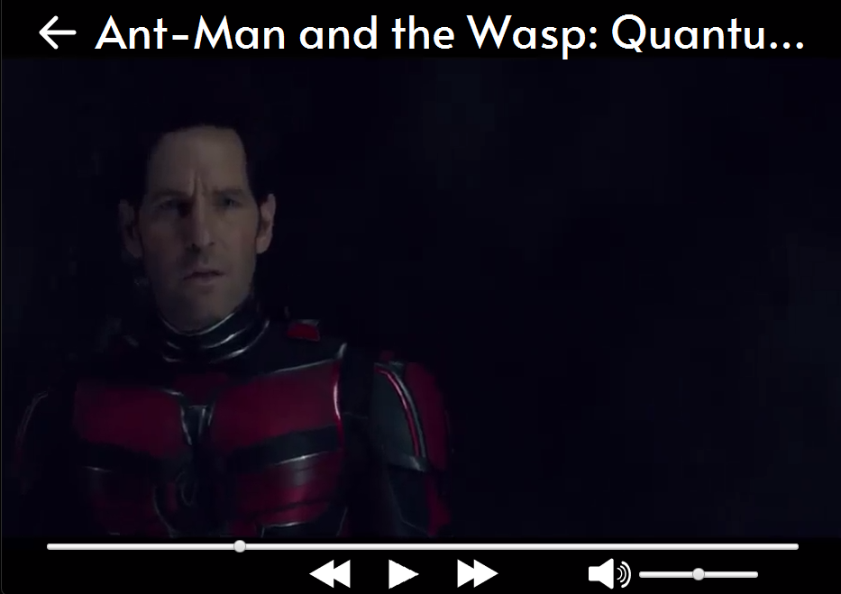
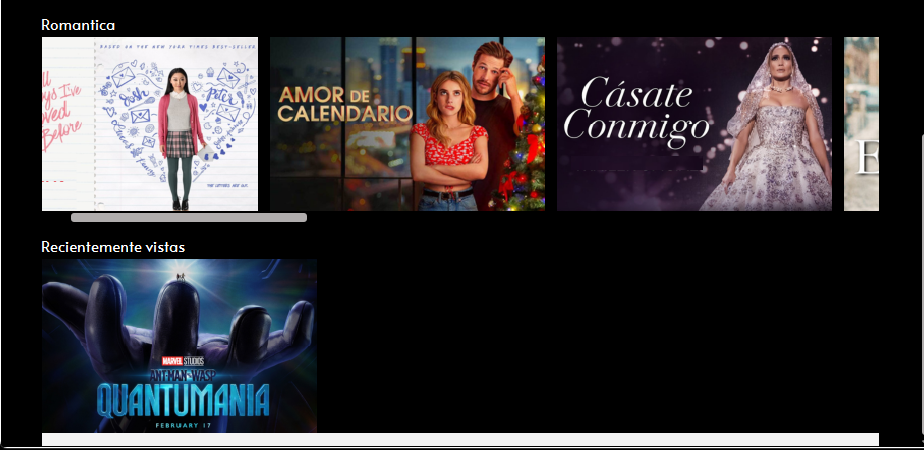

# OnyxFlix - Reproductor de Contenido Multimedia en JavaFX



## Tabla de Contenidos
- [Descripción General](#descripción-general)
- [Características](#características)
- [Pantallas](#pantallas-y-funcionalidades)
  - [Pantalla Principal](#pantalla-principal)
  - [Detalles de Película](#detalles-de-película)
  - [Reproductor](#reproductor)
  - [Recientes](#recientes)
- [Requisitos](#requisitos-del-sistema)
- [Instalación](#instalación)
- [Uso](#uso)
- [Capturas de Pantalla](#capturas-de-pantalla)
- [Notas Adicionales](#notas-adicionales)

## Descripción General
OnyxFlix es un reproductor de contenido multimedia (MP4) desarrollado en Java con JavaFX que permite reproducir películas.

## Características
- Organización de películas por categorías
- Sección "Mi Lista" para favoritos
- Historial de películas recientemente vistas
- Control de reproduccion
- Detalles completos de cada película

## Pantallas

### Pantalla Principal


- Sección "Mi Lista" (colección personal)
- Secciones por categorías
- Tarjetas de películas con título


### Detalles de Película


- Título
- Información de producción
- Elenco principal
- Género y descripción
- Botón de reproducción
- Botón de agregar a mi lista

### Reproductor


**Controles:**
- Play/Pause
- Adelantar/atrasar 10 segundos
- Control de volumen
- Barra de progreso
- Pantalla completa

### Recientes


**Contenido:**
- Listado automático de películas vistas recientemente

## Requisitos
- Java JDK 8+
- JavaFX SDK
- Maven

## Instalación
1. Clonar el repositorio:
```bash
git clone https://github.com/Hugodiazz/OnyxFlix.git
```

2. Importar proyecto en IDE

## Uso
1. Ejecutar la clase `Main.java`
1. Navegar por las categorías en la pantalla principal
2. Seleccionar una película para ver detalles
3. Hacer clic en "REPRODUCIR AHORA" para iniciar
4. Usar los controles del reproductor
5. 
## Capturas de Pantalla
| Vista | Imagen |
|-------|--------|
| Principal |  |
| Detalles |  |
| Reproductor |  |
| Recientes |  |


## Notas Adicionales
- El proyecto utiliza el patrón MVC
- Los datos de las peliculas están precargados como demostración.
